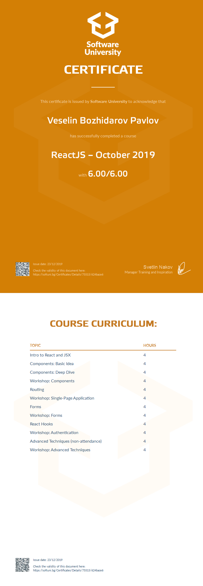

<a href="https://softuni.bg/trainings/courses" rel="Courses">  ![SoftUni logo][logo] <a/>

[logo]: http://innovationstarterbox.bg/wp-content/uploads/2016/05/Softuni_logo_trasparent.png "Logo Title Text 2"

---

# Course: ReactJS

## Topics:
01. Intro to React and JSX
02. React Components
03. Events and Forms
04. Routing and Architecture
05. Add-On Libraries
06. React Hooks
07. Advanced Tehniques

## Certificate: 

